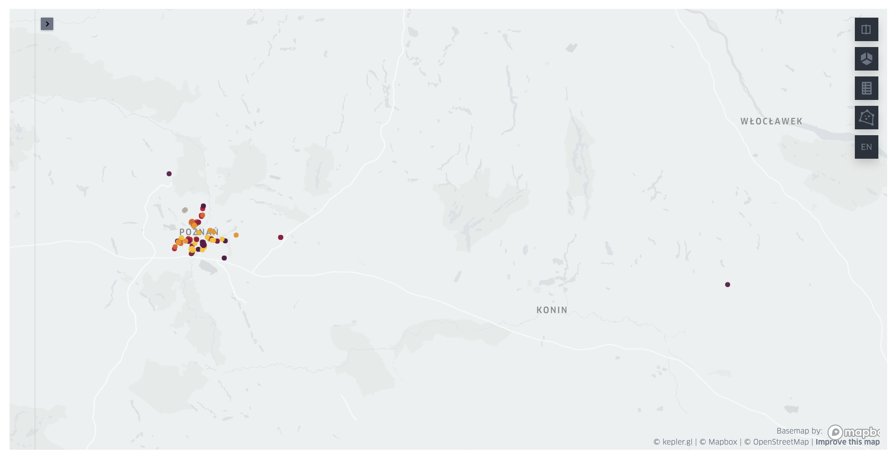

# From pdf table to map with location pins

Recently I have done review of my wardrobe and found a bunch of clothes that I do not wear any more. They were still in good condition, so I decided to donate them to the charity. I've searched for the charity boxes in my city and found a pdf file with a table listing all clothing donation boxes in my voivodeship. Those were a lot of boxes (over two thousands), and there were just city and street addresses of them. I wanted to find one closest to my place, but definitely did not want to look up each address individually. Threrefore, I've decided to make a small script, that will parse this pdf table into pandas, query map coordinates for the addresses, and display them on a map. Here is a quick tutorial, how I've done it.

> :mortar_board: **What you'll learn below?**
> * How to parse table from pdf document into a pandas dataframe.
> * How to query geo coordinates for the address string in Python.
> * How to display locations on a map in Python.

Libraries you'll need: `camelot`, `geopandas`, `pandas`, `geopy`, `keplergl`.

If you want to follow this tutorial with the same pdf doucment, you can get the table from [here](https://pck.pl/tekstylia/files/pojemniki-wielkopolskie.pdf) or simply run:
```bash
wget https://pck.pl/tekstylia/files/pojemniki-wielkopolskie.pdf
```

Let's import libraries we'll need and begin.


```python
import camelot
import geopandas as gpd
import pandas as pd
from geopy.geocoders import Bing
from keplergl import KeplerGl
```

## Parsing pdf table into pandas dataframe

First we need to parse the pdf table into a pandas dataframe. This is pretty straightforward with the `camelot` library.


```python
tables = camelot.read_pdf("pojemniki-wielkopolskie.pdf", pages="1-38")
```

I've parsed pages  1-38 (not all, as is possible with "all" option) to optimize the reading process. This doucment contains over a thousend pages, but only first 38 contain information, the rest is empty.

> :bulb: Tip for using `camelot` on MacOS
> Camelot requires Ghostscript and Tkinter dependencies. I didn't have any problems with Tkinter installation (`brew install tcl-tk`). But Had some troubles with making Ghostscript run. I've tried multiple fixes and finally found [this Stack Overflow answer](https://stackoverflow.com/a/70182757), which have worked for me.
> To correctly install and setup ghostscript I did:
> ```bash
> brew install ghostscript
> conda install ghostscript # if fails then: conda install -c conda-forge ghostscript
> pip install ghostscript
>```


```python
tables
```


    <TableList n=37>


37 individual table were parsed. Now we need to concatenate them to a single dataframe.


```python
table_df = pd.concat([table.df for table in tables]).reset_index(drop=True)
table_df.columns = table_df.iloc[0]
table_df = table_df.iloc[1:]
table_df.head()
```


<div>
<table border="1" class="dataframe">
  <thead>
    <tr style="text-align: right;">
      <th></th>
      <th>Miejscowość</th>
      <th>Powiat</th>
      <th>Adres lokalizacji</th>
      <th>Numer</th>
    </tr>
  </thead>
  <tbody>
    <tr>
      <th>1</th>
      <td>Chrzypsko Wielkie</td>
      <td>międzychodzki</td>
      <td>Chrzypsko ul. Szkolna\nChrzypsko ul. Jeziorna\...</td>
      <td>87649\n87645\n87651\n87654\n87646</td>
    </tr>
    <tr>
      <th>2</th>
      <td>Czarnków</td>
      <td>czarnkowsko-\ntrzcianecki</td>
      <td>Huta\nGębice\nBrzeźno\nSarbka\nMarunowo\nRoman...</td>
      <td>47289\n38863\n50674\n61254\n38864\n47298\n5153...</td>
    </tr>
    <tr>
      <th>3</th>
      <td>Drawsko</td>
      <td>czarnkowsko-\ntrzcianecki</td>
      <td>Drawski Młyn dz. 793/5\nDrawski Młyn dz. 793/5...</td>
      <td>9385\n63159\n45201\n47294\n28355\n1szt.\n41126...</td>
    </tr>
    <tr>
      <th>4</th>
      <td>Koźmin Wlkp</td>
      <td>krotoszyński</td>
      <td>Koźmin Wlkp ul. Benedykta z Koźmina\nKoźmin Wl...</td>
      <td>94789\n94794\n88879\n88875\n88880</td>
    </tr>
    <tr>
      <th>5</th>
      <td>Margonin</td>
      <td>chodzieski</td>
      <td>Margonin ul. Mickiewicza\nMargonin ul. Broniew...</td>
      <td>40831\n45189\n7449\n95443\n59233\n48394\n21611...</td>
    </tr>
  </tbody>
</table>
</div>


Names of the columns are in Polish so for more clarity, we'll translate them.


```python
CITY_COL = "city"
COUNTY_COL = "county"
ADDRESS_COL = "address"
NUMBER_COL = "number"

col_names_map = {
    "Miejscowość": CITY_COL,
    "Powiat": COUNTY_COL,
    "Adres lokalizacji": ADDRESS_COL,
    "Numer": NUMBER_COL,
}

table_df.columns = table_df.columns.map(col_names_map)
table_df.head()
```


<div>
<table border="1" class="dataframe">
  <thead>
    <tr style="text-align: right;">
      <th></th>
      <th>city</th>
      <th>county</th>
      <th>address</th>
      <th>number</th>
    </tr>
  </thead>
  <tbody>
    <tr>
      <th>1</th>
      <td>Chrzypsko Wielkie</td>
      <td>międzychodzki</td>
      <td>Chrzypsko ul. Szkolna\nChrzypsko ul. Jeziorna\...</td>
      <td>87649\n87645\n87651\n87654\n87646</td>
    </tr>
    <tr>
      <th>2</th>
      <td>Czarnków</td>
      <td>czarnkowsko-\ntrzcianecki</td>
      <td>Huta\nGębice\nBrzeźno\nSarbka\nMarunowo\nRoman...</td>
      <td>47289\n38863\n50674\n61254\n38864\n47298\n5153...</td>
    </tr>
    <tr>
      <th>3</th>
      <td>Drawsko</td>
      <td>czarnkowsko-\ntrzcianecki</td>
      <td>Drawski Młyn dz. 793/5\nDrawski Młyn dz. 793/5...</td>
      <td>9385\n63159\n45201\n47294\n28355\n1szt.\n41126...</td>
    </tr>
    <tr>
      <th>4</th>
      <td>Koźmin Wlkp</td>
      <td>krotoszyński</td>
      <td>Koźmin Wlkp ul. Benedykta z Koźmina\nKoźmin Wl...</td>
      <td>94789\n94794\n88879\n88875\n88880</td>
    </tr>
    <tr>
      <th>5</th>
      <td>Margonin</td>
      <td>chodzieski</td>
      <td>Margonin ul. Mickiewicza\nMargonin ul. Broniew...</td>
      <td>40831\n45189\n7449\n95443\n59233\n48394\n21611...</td>
    </tr>
  </tbody>
</table>
</div>


The `address` and `number` columns have multiline strings in them, were each line corresponds to a separate charity box. We'll need to expand them to individual rows. But first, I've noticed that, because of those multiline values, some cells in the pdf file start on the one page and end on the other. This results in the empty values for the first two columns (`city` and `county`).


```python
table_df.loc[
    (table_df.loc[:, CITY_COL] == "") | (table_df.loc[:, COUNTY_COL] == "")
].shape
```


    (46, 4)


However, we know, that those values should be the same as in the row above them. Therefore we can easily impute them.


```python
for col in [0, 1]:
    for i in range(len(table_df)):
        if table_df.iloc[i, col] == "":
            table_df.iloc[i, col] = prev_val
        prev_val = table_df.iloc[i, col]
```

Let's make sure we don't have empty values in those columns anymore.


```python
assert table_df.loc[
    (table_df.loc[:, CITY_COL] == "") | (table_df.loc[:, COUNTY_COL] == "")
].empty
```

I'm interested only in boxes located in the Poznań city. So to speed up following steps, let's filter only relevant rows.


```python
table_df = table_df.query(f"`{CITY_COL}` == 'Poznań'")
table_df.shape
```


    (24, 4)


Now, we can expand multiline strings in `address` and `number` fields into individual rows. First, we'll split those lines to lists.


```python
table_df = table_df.assign(
    **{ADDRESS_COL: table_df.loc[:, ADDRESS_COL].str.split("\n")}
).assign(**{NUMBER_COL: table_df.loc[:, NUMBER_COL].str.split("\n")})
table_df.head()
```


<div>
<table border="1" class="dataframe">
  <thead>
    <tr style="text-align: right;">
      <th></th>
      <th>city</th>
      <th>county</th>
      <th>address</th>
      <th>number</th>
    </tr>
  </thead>
  <tbody>
    <tr>
      <th>11</th>
      <td>Poznań</td>
      <td>Poznań</td>
      <td>[Poznań ul.Dmowskiego 5/7, Poznań ul. Bogusław...</td>
      <td>[88485, 87156, 88477, 87852, 88481, 88084, 956...</td>
    </tr>
    <tr>
      <th>16</th>
      <td>Poznań</td>
      <td>Poznań</td>
      <td>[Osiedle Przyjaźni 3 altana śmietnikowa , Osie...</td>
      <td>[88601, 88593, 88596, 88603, 88604, 87644, 876...</td>
    </tr>
    <tr>
      <th>18</th>
      <td>Poznań</td>
      <td>Poznań</td>
      <td>[Poznań ul. Dolna Wilda 30-42, Poznań ul. Doln...</td>
      <td>[88482, 88484, 87159, 95123, 87160, 87162, 954...</td>
    </tr>
    <tr>
      <th>25</th>
      <td>Poznań</td>
      <td>Poznań</td>
      <td>[Poznań ul. Sarmacka 16, Poznań ul. Sarmacka 1...</td>
      <td>[87154, 87155, 87153, 87658, 87655, 87657, 876...</td>
    </tr>
    <tr>
      <th>33</th>
      <td>Poznań</td>
      <td>Poznań</td>
      <td>[Poznań ul. Dębina 17c, Poznań ul. Dębina 16a,...</td>
      <td>[88037, 88033, 88036, 38464, 82700]</td>
    </tr>
  </tbody>
</table>
</div>


Now, we'll make sure lists have the same length for all corresponding `address` and `number` fields.


```python
table_df.loc[
    (table_df.loc[:, ADDRESS_COL].map(len) != table_df.loc[:, NUMBER_COL].map(len))
]
```


<div>
<table border="1" class="dataframe">
  <thead>
    <tr style="text-align: right;">
      <th></th>
      <th>city</th>
      <th>county</th>
      <th>address</th>
      <th>number</th>
    </tr>
  </thead>
  <tbody>
    <tr>
      <th>16</th>
      <td>Poznań</td>
      <td>Poznań</td>
      <td>[Osiedle Przyjaźni 3 altana śmietnikowa , Osie...</td>
      <td>[88601, 88593, 88596, 88603, 88604, 87644, 876...</td>
    </tr>
  </tbody>
</table>
</div>


There is an issue for one row. It's due to error in parsing. We'll fix it by manually correcting this row data.


```python
table_df.loc[[16]] = pd.DataFrame.from_dict(
    {
        CITY_COL: {16: "Poznań"},
        COUNTY_COL: {16: "Poznań"},
        ADDRESS_COL: {
            16: [
                "Osiedle Przyjaźni 3 altana śmietnikowa ",
                "Osiedle Przyjaźni 10 altana śmietnikowa",
                "Osiedle Przyjaźni 4-10 altana śmietnikowa",
                "Osiedle Przyjaźni 8-9 altana śmietnikowa",
                "Osiedle Przyjaźni 8-9 altana śmietnikowa",
                "Osiedle Przyjaźni 5-7 altana śmietnikowa",
                "Osiedle Przyjaźni  11 altana śmietnikowa",
                "Osiedle Przyjaźni 17 altana śmietnikowa",
                "Osiedle Przyjaźni 23 altana śmietnikowa",
                "Osiedle Przyjaźni 12 altana śmietnikowa",
                "Osiedle Przyjaźni 13 G-F altana śmietnikowa",
                "Osiedle Przyjaźni 18 altana śmietnikowa",
                "Osiedle Przyjaźni 141A altana śmietnikowa , pawilon sklepu Chata Polska",
                "Osiedle Przyjaźni 1-2 altana śmietnikowa",
            ]
        },
        NUMBER_COL: {
            16: [
                "88601",
                "88593",
                "88596",
                "88603",
                "88604",
                "87644",
                "87643",
                "87241",
                "88600",
                "88599",
                "88602",
                "88042",
                "88041",
                "87243",
            ]
        },
    }
)
```

Let's make sure we've fixed the issue.


```python
assert table_df.loc[
    (table_df.loc[:, ADDRESS_COL].map(len) != table_df.loc[:, NUMBER_COL].map(len))
].empty
```

Now we can expand lists in `address` and `number` columns into separate rows.


```python
table_df = table_df.explode([ADDRESS_COL, NUMBER_COL])
table_df = table_df.reset_index(drop=True)
table_df.head()
```


<div>
<table border="1" class="dataframe">
  <thead>
    <tr style="text-align: right;">
      <th></th>
      <th>city</th>
      <th>county</th>
      <th>address</th>
      <th>number</th>
    </tr>
  </thead>
  <tbody>
    <tr>
      <th>0</th>
      <td>Poznań</td>
      <td>Poznań</td>
      <td>Poznań ul.Dmowskiego 5/7</td>
      <td>88485</td>
    </tr>
    <tr>
      <th>1</th>
      <td>Poznań</td>
      <td>Poznań</td>
      <td>Poznań ul. Bogusławskiego 16</td>
      <td>87156</td>
    </tr>
    <tr>
      <th>2</th>
      <td>Poznań</td>
      <td>Poznań</td>
      <td>Poznań ul. Bogusławskiego 32</td>
      <td>88477</td>
    </tr>
    <tr>
      <th>3</th>
      <td>Poznań</td>
      <td>Poznań</td>
      <td>Poznań ul. Bogusławskiego 16</td>
      <td>87852</td>
    </tr>
    <tr>
      <th>4</th>
      <td>Poznań</td>
      <td>Poznań</td>
      <td>Poznań ul. Stablewskiego 6</td>
      <td>88481</td>
    </tr>
  </tbody>
</table>
</div>


Some values in `address` column contain unneccessary duplicate of the city name, we'll remove it now.


```python
table_df.loc[:, ADDRESS_COL] = table_df.loc[:, ADDRESS_COL].str.replace("Poznań ", "")
```

## Getting geo coordinates for a location name

Now we are ready to get geo coordinates for the addresses in the table. First we'll add a country column and compose a full address field, to make coords search easier.


```python
COUNTRY_COL = "country"
FULL_ADDRESS_COL = "full_address"

table_df[COUNTRY_COL] = "Poland"
table_df[FULL_ADDRESS_COL] = table_df.loc[:, [ADDRESS_COL, CITY_COL, COUNTRY_COL]].agg(
    ",".join, axis="columns"
)
table_df.head()
```


<div>
<table border="1" class="dataframe">
  <thead>
    <tr style="text-align: right;">
      <th></th>
      <th>city</th>
      <th>county</th>
      <th>address</th>
      <th>number</th>
      <th>country</th>
      <th>full_address</th>
    </tr>
  </thead>
  <tbody>
    <tr>
      <th>0</th>
      <td>Poznań</td>
      <td>Poznań</td>
      <td>ul.Dmowskiego 5/7</td>
      <td>88485</td>
      <td>Poland</td>
      <td>ul.Dmowskiego 5/7,Poznań,Poland</td>
    </tr>
    <tr>
      <th>1</th>
      <td>Poznań</td>
      <td>Poznań</td>
      <td>ul. Bogusławskiego 16</td>
      <td>87156</td>
      <td>Poland</td>
      <td>ul. Bogusławskiego 16,Poznań,Poland</td>
    </tr>
    <tr>
      <th>2</th>
      <td>Poznań</td>
      <td>Poznań</td>
      <td>ul. Bogusławskiego 32</td>
      <td>88477</td>
      <td>Poland</td>
      <td>ul. Bogusławskiego 32,Poznań,Poland</td>
    </tr>
    <tr>
      <th>3</th>
      <td>Poznań</td>
      <td>Poznań</td>
      <td>ul. Bogusławskiego 16</td>
      <td>87852</td>
      <td>Poland</td>
      <td>ul. Bogusławskiego 16,Poznań,Poland</td>
    </tr>
    <tr>
      <th>4</th>
      <td>Poznań</td>
      <td>Poznań</td>
      <td>ul. Stablewskiego 6</td>
      <td>88481</td>
      <td>Poland</td>
      <td>ul. Stablewskiego 6,Poznań,Poland</td>
    </tr>
  </tbody>
</table>
</div>


Now we'll use Bing maps API to get coordinates for our addresses. There are many different APIs available. I've chosen Bing, because it works very well and offers free API key for 125k requests for non-commercial use (you can get it [here](https://www.microsoft.com/en-us/maps/bing-maps/create-a-bing-maps-key#basic)).


```python
geolocator = Bing("***REMOVED***")
```

We have the geolocator set up. Now we'll add latitude and longitude columns, and fill them with coordinates from the API.


```python
LAT_COL = "latitude"
LONG_COL = "longitude"

table_df[LAT_COL] = ""
table_df[LONG_COL] = ""
for ind in table_df.index:
    loc = geolocator.geocode(table_df.loc[ind, FULL_ADDRESS_COL])
    table_df.loc[ind, LAT_COL] = loc.latitude
    table_df.loc[ind, LONG_COL] = loc.longitude
table_df.head()
```


<div>
<table border="1" class="dataframe">
  <thead>
    <tr style="text-align: right;">
      <th></th>
      <th>city</th>
      <th>county</th>
      <th>address</th>
      <th>number</th>
      <th>country</th>
      <th>full_address</th>
      <th>latitude</th>
      <th>longitude</th>
    </tr>
  </thead>
  <tbody>
    <tr>
      <th>0</th>
      <td>Poznań</td>
      <td>Poznań</td>
      <td>ul.Dmowskiego 5/7</td>
      <td>88485</td>
      <td>Poland</td>
      <td>ul.Dmowskiego 5/7,Poznań,Poland</td>
      <td>52.393064</td>
      <td>16.900942</td>
    </tr>
    <tr>
      <th>1</th>
      <td>Poznań</td>
      <td>Poznań</td>
      <td>ul. Bogusławskiego 16</td>
      <td>87156</td>
      <td>Poland</td>
      <td>ul. Bogusławskiego 16,Poznań,Poland</td>
      <td>52.394215</td>
      <td>16.894152</td>
    </tr>
    <tr>
      <th>2</th>
      <td>Poznań</td>
      <td>Poznań</td>
      <td>ul. Bogusławskiego 32</td>
      <td>88477</td>
      <td>Poland</td>
      <td>ul. Bogusławskiego 32,Poznań,Poland</td>
      <td>52.392208</td>
      <td>16.892817</td>
    </tr>
    <tr>
      <th>3</th>
      <td>Poznań</td>
      <td>Poznań</td>
      <td>ul. Bogusławskiego 16</td>
      <td>87852</td>
      <td>Poland</td>
      <td>ul. Bogusławskiego 16,Poznań,Poland</td>
      <td>52.394215</td>
      <td>16.894152</td>
    </tr>
    <tr>
      <th>4</th>
      <td>Poznań</td>
      <td>Poznań</td>
      <td>ul. Stablewskiego 6</td>
      <td>88481</td>
      <td>Poland</td>
      <td>ul. Stablewskiego 6,Poznań,Poland</td>
      <td>52.392838</td>
      <td>16.8956</td>
    </tr>
  </tbody>
</table>
</div>


Let's save it to csv, so we don't need to query the API next time.


```python
table_df.to_csv("donation_boxes_Poznan_df.csv")
```

## Showing geo locations with address info on a map

Now, we can visualize  donation boxes on the map. We'll use `geopandas` and `keplergl` libraries for that.
If you just want to test visualization method, wthout parsing pdf and querying the API, simply load the csv file.


```python
table_df = pd.read_csv("donation_boxes_Poznan_df.csv", index_col=0)
table_df.head()
```


<div>
<table border="1" class="dataframe">
  <thead>
    <tr style="text-align: right;">
      <th></th>
      <th>city</th>
      <th>county</th>
      <th>address</th>
      <th>number</th>
      <th>country</th>
      <th>full_address</th>
      <th>latitude</th>
      <th>longitude</th>
    </tr>
  </thead>
  <tbody>
    <tr>
      <th>0</th>
      <td>Poznań</td>
      <td>Poznań</td>
      <td>ul.Dmowskiego 5/7</td>
      <td>88485</td>
      <td>Poland</td>
      <td>ul.Dmowskiego 5/7,Poznań,Poland</td>
      <td>52.393064</td>
      <td>16.900942</td>
    </tr>
    <tr>
      <th>1</th>
      <td>Poznań</td>
      <td>Poznań</td>
      <td>ul. Bogusławskiego 16</td>
      <td>87156</td>
      <td>Poland</td>
      <td>ul. Bogusławskiego 16,Poznań,Poland</td>
      <td>52.394215</td>
      <td>16.894152</td>
    </tr>
    <tr>
      <th>2</th>
      <td>Poznań</td>
      <td>Poznań</td>
      <td>ul. Bogusławskiego 32</td>
      <td>88477</td>
      <td>Poland</td>
      <td>ul. Bogusławskiego 32,Poznań,Poland</td>
      <td>52.392208</td>
      <td>16.892817</td>
    </tr>
    <tr>
      <th>3</th>
      <td>Poznań</td>
      <td>Poznań</td>
      <td>ul. Bogusławskiego 16</td>
      <td>87852</td>
      <td>Poland</td>
      <td>ul. Bogusławskiego 16,Poznań,Poland</td>
      <td>52.394215</td>
      <td>16.894152</td>
    </tr>
    <tr>
      <th>4</th>
      <td>Poznań</td>
      <td>Poznań</td>
      <td>ul. Stablewskiego 6</td>
      <td>88481</td>
      <td>Poland</td>
      <td>ul. Stablewskiego 6,Poznań,Poland</td>
      <td>52.392838</td>
      <td>16.895600</td>
    </tr>
  </tbody>
</table>
</div>


Visualization step is very easy. We'll convert dataframe with address info to `geopandas.GeoDataFrame` and then add it to `keplergl.KeplerGL` map. (I've also changed map's theme to light. Yes, I use light themes. Crazy, I know.)


```python
map = KeplerGl(
    height=600,
    width=800,
    config={"version": "v1", "config": {"mapStyle": {"styleType": "light"}}},
)

table_geo = gpd.GeoDataFrame(
    table_df,
    geometry=gpd.points_from_xy(table_df.loc[:, LONG_COL], table_df.loc[:, LAT_COL]),
)

map.add_data(data=table_geo, name="charity boxes")
map
```

    User Guide: https://docs.kepler.gl/docs/keplergl-jupyter


